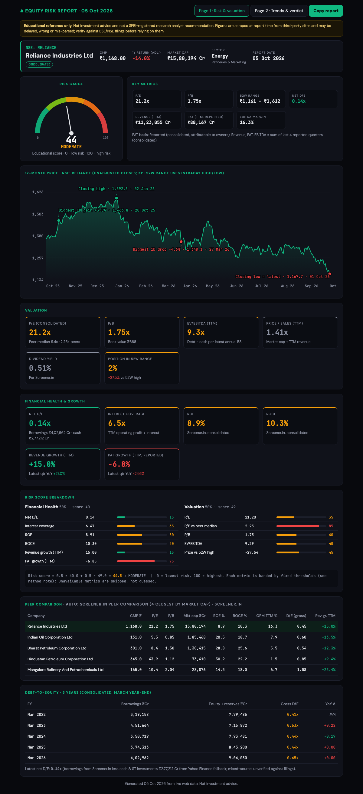
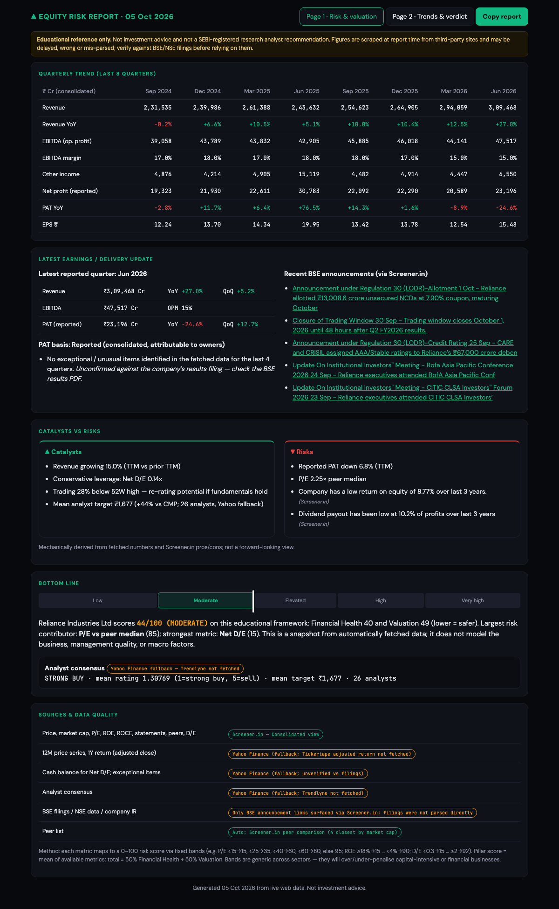

# Stock Risk Analyst (NSE)

Streamlit app that generates a two-page equity risk report for an NSE-listed company from live web data
(Screener.in consolidated figures; Yahoo Finance as a labelled fallback for price history, cash and consensus).

```
python3 -m venv .venv && .venv/bin/pip install -r requirements.txt
.venv/bin/streamlit run app.py
```

## Screenshots

Sample report for Reliance Industries (generated 5 Oct 2026).

**Page 1 — risk gauge, valuation, financial health, peers, D/E history**



**Page 2 — quarterly trend, latest update, catalysts vs risks, verdict, sources**



Educational reference only. Not investment advice or a SEBI-registered research recommendation.
